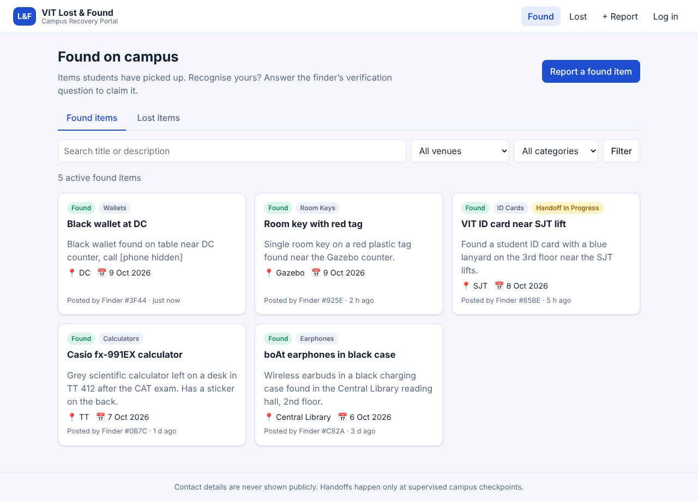
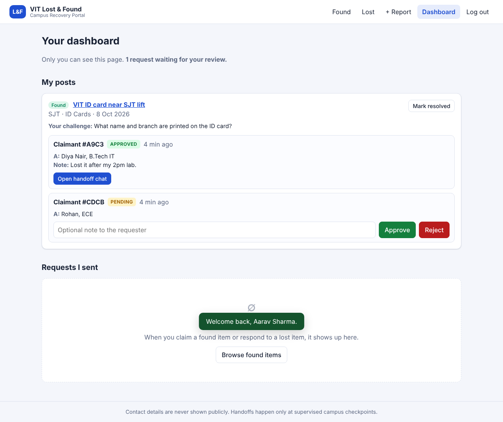
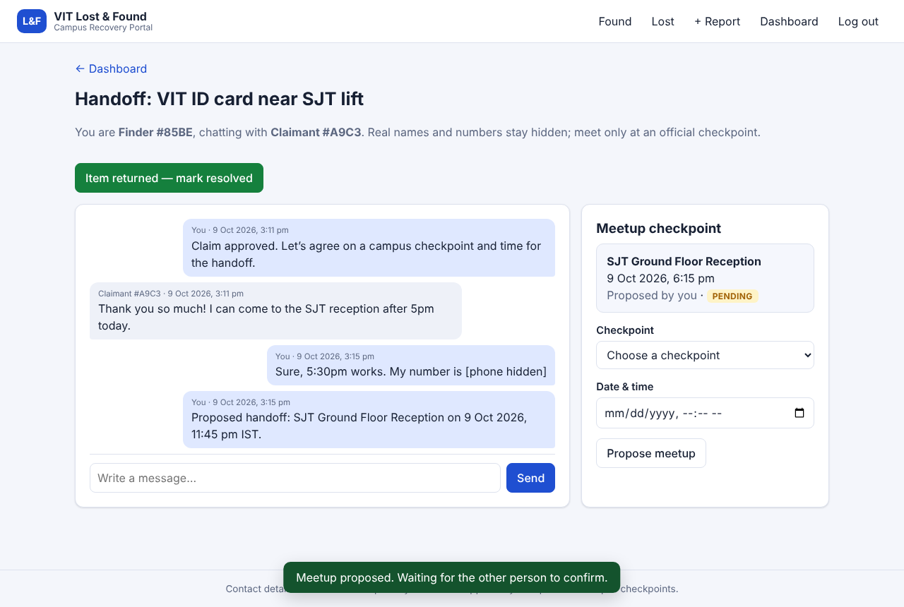

# VIT Campus Lost & Found Recovery Portal

A full-stack recovery platform for the VIT campus community that replaces messy WhatsApp groups. Students report lost or found items at official campus venues, prove ownership through a private verification challenge, and coordinate a safe handoff at a supervised checkpoint, all without ever exposing their registration number, email or mobile number.

**Stack:** Node.js 20+ · Express 5 · SQLite (better-sqlite3) · vanilla HTML/CSS/JS frontend (no build step) · JWT auth with bcrypt-hashed passwords.

| Boards | Private dashboard | Handoff chat |
| --- | --- | --- |
|  |  |  |

## Quick start

```bash
git clone <this-repo-url>
cd vit-lost-found
npm run setup        # npm install + create the database + load demo data
npm start            # http://localhost:3000
```

Then log in with any demo account (password `Password123`):

| Account | Role in demo data |
| --- | --- |
| `aarav.sharma2022@vitstudent.ac.in` | Found an ID card; has one approved claim (live handoff chat) and one pending claim to review |
| `diya.nair2022@vitstudent.ac.in` | Approved claimant of the ID card; posted several items |
| `rohan.iyer2023@vitstudent.ac.in` | Has a pending claim; posted a lost wallet |

Open two browsers (or a normal and a private window) with different accounts to see both sides of a claim and handoff.

## Database bootstrap scripts

| Command | What it does |
| --- | --- |
| `npm run db:init` | Creates `data/lostfound.db` and the schema (`users`, `items`, `claims`, `messages`). Safe to re-run. |
| `npm run db:seed` | Loads demo users, items, claims and a handoff chat. Skips if users already exist. |
| `npm run db:reset` | Deletes the database file and re-creates it with fresh demo data. |

The schema lives in [`src/db.js`](src/db.js) and is also applied automatically when the server starts, so `npm start` works on an empty checkout after `npm install`.

## Configuration

| Variable | Default | Purpose |
| --- | --- | --- |
| `PORT` | `3000` | HTTP port |
| `DB_PATH` | `data/lostfound.db` | SQLite database file |
| `JWT_SECRET` | dev-only fallback (warns on start) | Secret for signing login tokens. **Set this in any real deployment.** |
| `AUTH_RATE_LIMIT` | `30` | Login/register attempts allowed per IP per 15 minutes |

Example: `JWT_SECRET=$(openssl rand -hex 32) PORT=8080 npm start`

## Running tests

```bash
npm test
```

The API test suite (`node:test`, in-memory SQLite) covers validation, privacy masking, the full post → claim → approve → chat → meetup → resolve flow, authorization checks, and error responses.

## Features

### Campus venues and category tagging
- Separate **Found** and **Lost** boards with search, venue and category filters, and pagination.
- Locations are restricted (client and server) to official landmarks: Academic Blocks (SJT, TT, PRP, SMV, MB, GDN, CDMM), Men's Hostels MH-A to MH-T, Ladies' Hostels LH-A to LH-J, Food Courts (Gazebo, Food Mall, DC), Central Library and Sports Complex.
- Categories: ID Cards, Room Keys, Calculators, Lab Equipment, Earphones, Wallets.

### Student authentication and privacy
- Sign-up requires a `@vitstudent.ac.in` email, a registration number like `22BCE1234`, and a valid Indian mobile number. Passwords are bcrypt-hashed.
- Public listings never include the poster's name, registration number, email or phone. Posters appear only as a stable per-item pseudonym such as `Finder #3F44`.
- Contact details typed into titles, descriptions, claim notes or chat messages (phone numbers, emails, registration numbers) are masked automatically, e.g. `call [phone hidden]`.

### Ownership verification workflow
- Every post carries a custom **verification challenge** set by the poster (e.g. "What name/branch is on the ID tag?").
- A claimant sees the challenge, never the finder's identity, and submits a **Claim Verification Request** with their answer.
- The poster reviews answers in a private **Dashboard** (claimants are shown by pseudonym only) and clicks **Approve** or **Reject**, with an optional note.
- Lost posts work the same way in reverse: a student who found the item answers the owner's question and the owner approves.

### Safe in-app handoff coordination
- Approval opens a private chat visible only to the two parties, who still see each other only by pseudonym.
- Either party proposes a meetup at an official checkpoint (SJT Ground Floor Reception, Central Library Security Desk, TT Main Entrance Security Desk, Main Gate Security Office, Food Mall Entrance, Sports Complex Front Desk) and a time; the other party confirms.

### Lifecycle management
- Either the poster or the approved claimant can mark the item **Resolved**. It immediately leaves the public boards, remaining pending claims are closed, and the chat becomes read-only.
- Items with an approved claim show a "Handoff in progress" badge.

### Validation, errors and UI feedback
- Every input is validated on the server (lengths, enums, dates not in the future, meetup within 30 days, etc.) with per-field error messages; the frontend mirrors these checks and highlights invalid fields.
- Loading spinners for every fetch, empty states for empty boards/filters/dashboards, button loading states, success toasts and "submitted" confirmations, and a retry option on network errors.

## API overview

| Method & path | Auth | Description |
| --- | --- | --- |
| `POST /api/auth/register`, `POST /api/auth/login` | – | Returns `{ token, user }` |
| `GET /api/auth/me` | ✓ | Your own profile |
| `GET /api/meta` | – | Venues, categories, checkpoints |
| `GET /api/items?type=found\|lost&venue=&category=&q=&page=` | – | Active public listings (masked) |
| `GET /api/items/:id` | optional | Item detail + your claim status |
| `POST /api/items` | ✓ | Report an item |
| `POST /api/items/:id/claims` | ✓ | Submit a verification request |
| `POST /api/items/:id/resolve` | ✓ | Mark resolved (poster or approved claimant) |
| `GET /api/dashboard` | ✓ | Your posts with incoming claims, and claims you sent |
| `POST /api/claims/:id/decision` | ✓ | `{ decision: "approve" \| "reject", note }` (poster only) |
| `GET /api/claims/:id/thread` | ✓ | Private handoff thread (parties only, approved claims) |
| `POST /api/claims/:id/messages` | ✓ | Send a chat message |
| `POST /api/claims/:id/meetup`, `POST /api/claims/:id/meetup/confirm` | ✓ | Propose / confirm a checkpoint meetup |

Errors are JSON: `{ "error": "message", "fields": { "field": "message" } }`.

## Project structure

```
src/
  server.js        entry point
  app.js           Express app, security headers, error handler
  db.js            SQLite connection + schema
  auth.js          register/login, JWT middleware, rate limiting
  validation.js    all input validation
  privacy.js       contact-info masking and pseudonyms
  constants.js     venues, categories, checkpoints
  routes/items.js  boards, item detail, posting, claiming, resolving
  routes/claims.js dashboard, approve/reject, handoff chat and meetups
scripts/           db:init and db:seed
public/            single-page frontend (index.html, app.js, styles.css)
test/              API tests
```

## Trade-offs and what I would improve

- **Email verification / VIT SSO:** accounts are restricted to `@vitstudent.ac.in` addresses but the address is not verified by OTP. In production I would add OTP email verification or VIT SSO.
- **Chat is polled** every 5 seconds instead of using WebSockets, which keeps the stack simple and is plenty for this traffic level.
- **Photos** of items are not supported yet; they would need storage and moderation (and care not to reveal the verification answer).
- **Notifications** (email or push when a claim arrives or is approved) would make the workflow faster.
- **Abuse controls:** add per-user claim limits, reporting of fake posts, and an admin/security-office moderation view.
- JWTs are stored in `localStorage` for simplicity; an httpOnly cookie with CSRF protection would be stronger.
